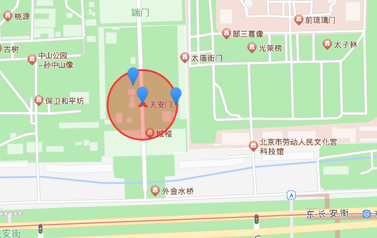

## Description

This repository is aimed at using redis geo commands to make service which provides information near certain place.

For example:
we use /addPosition to add three places

## Installation

```
/addPos?name=天安门&longitude=116.397444&latitude=39.909183

/addPos?name=文化宫科技馆&longitude=116.3993&latitude=39.908578

/addPos?name=售票处&longitude=116.397283&latitude=39.90943

/addPos?name=故宫彩扩部&longitude=116.398002&latitude=39.909175
```

Then we use map api to draw a circle near [116.397444, 39.909183]



```bash
$ pnpm install
```

## Running the app

```bash
# development
$ pnpm run start

# watch mode
$ pnpm run start:dev
```

## Reference

- https://mp.weixin.qq.com/s/BmqaLUuc84ams6m4ICezjg
